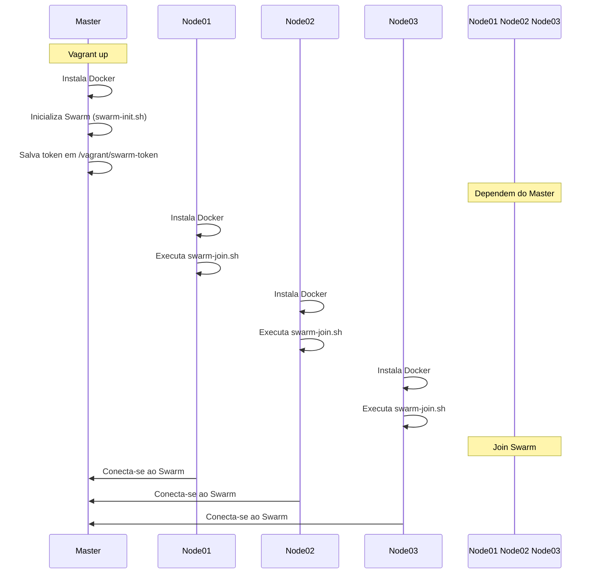

# Cluster Docker Swarm com Vagrant

Neste projeto básico para cria um cluster Docker Swarm com 4 máquinas virtuais no virtualbox, 
como estudo na DIO.

Irei criar:
- 1 nó **master** (manager)
- 3 nós **node01**, **node02**, **node03** (workers)

## Fluxo de Provisionamento

Clonar este repositório em todas as 4 máquinas virtuais criadas

Clone o repositório.

Execute vagrant up para criar as máquinas.

Acesse o master via vagrant ssh master.

Verifique o cluster com docker node ls.

Estrutura de Rede
| Máquina |	     IP      | Papel no Swarm |
| ------- |:------------:|:--------------:|  
| master | 192.168.56.10 | Manager        |
| node01 | 192.168.56.11 | Worker         |
| node02 | 192.168.56.12 | Worker         |
| node03 | 192.168.56.13 | Worker         |
