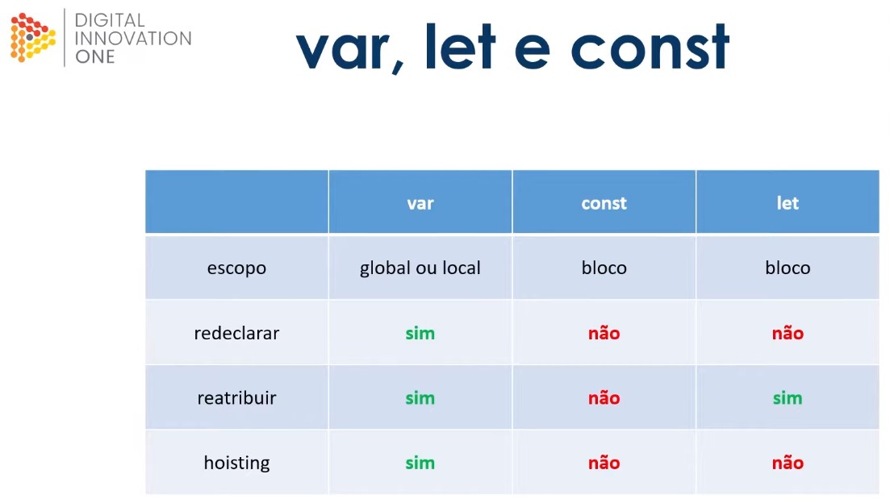

# Javascript

É uma linguagem de **tipagem dinâmica**, ou seja, antes de declarar um valor, você não especifica o **tipo** dele.

**Camel Case** - duas palavras juntas a segunda com primeira Letra Maiúscula

**Upper Case Snake Case** --> Utilizados por constantes, todas as letras em maíscula[_Upper Case_] e separadas por Underline{_snake case_}

Valores dinâmicos:

Palavras reservadas - Var e let </br>
**var** --> scope is global
**let** --> scope is inside the if-block

Uma variável declarada usando a declaração **var** ou **let** sem valor inicial tem como valor undefined.
Se tentarmos acessar uma variável não declarada será lançada uma exceção _"ReferenceError"_.

```javascript
var entrada;
try {
  if (entrada === undefined) {
    console.log("Variável entrada existe, porém foi declarada sem valor!");
  }
  if (saida === undefined) {
    console.log("Variável saida existe, porém foi declarada sem valor!");
  }
} catch (erro) {
  console.log(`A variável ${erro.message} (Não declarada)`);
}
```

**Redeclaração** --> var a = 11; :left_speech_bubble: Você informa o tipo, o nome e o valor </br>
**Reatribuição** --> a = 11; :left_speech_bubble: Você só informa o nome e valor

**Hoisting** --> atribuir um valor a uma variável antes de declará-la

Exemplo de como funciona o Hoisting

Neste exemplo irá funcionar porque ele entende que é uma **var**iável global:

```javascript
numberOne = 1;
console.log(numberOne + 2);

var numberOne;
```

Neste exemplo NÃO irá funcionar porque ele entende que a **_let_** é de escopo e precisa ser declarado antes de atribuído:

```javascript
numberOne = 1;
console.log(numberOne + 2);

let numberOne;
```

> :vertical_traffic_light: Redeclaração e Reatribuição

Escopo - É o contexto atual de execução, em que valores e expressões são "visíveis" ou podem ser referenciadas.

```javascript
var firstName = "João"; // Variável escopo Global
var lastName = "Souza"; // Variável escopo Global
let alias = "Joaozinho"; // Variável escopo de bloco

if (firstName == "João") {
  var firstName = "Pedro"; // Redeclaração da Variável
  lastName = "Silva"; // Reatribuição da Variável

  /* aqui teremos uma nova variável em outro espaço da memória */
  /* Não ficará disponível fora do escopo */
  let alias = "Pedrinho"; // Variável de bloco

  console.log(`Dentro do bloco if: ${firstName} ${lastName} ${alias}`);
}
console.log(`Fora do Bloco if: ${firstName} ${lastName} ${alias}`);
```

## CONSTANTES

São declaradas em SNAKE_UPPER_CASE, escopo de bloco, não faz **hoisting**

```javascript
const DAYS_IN_A_WEEK = 7; // Variável de bloco
const FIRST_NAME = "Aquiles"; // CONSTANTE declarar com SNAKE_UPPER_CASE
// e Sua atribuição é obrigatória

var LAST_NAME; // Global e não se deve usar com SNAKE_UPPER_CASE
// Uma 'var' pode ser declarada sem atribuição

console.log(FIRST_NAME);

FIRST_NAME = "Maria"; // Constantes não aceitam reatribuição!!!!
// Irá ocorrer erro!
```



Os dados em Javascript são divididos em 2 grandes grupos: **Primitivos** e os **Composite / Non-Primitive**.

### Primitivos

(numbers, string, boolean, null/underfined)

Não possuem métodos imbutidos, são escritos em letras minúsculas.

#### strings

Em sua declaração podemos utilizar, aspas "" / '' ou crases com interpolação **templates strings** `${}`.

Os dados do tipo **strings** são iteráveis.

Ex.:

```javascript

let nome = "João"
let sobrenome "Pedro"

// tipo de dado iterável. Assim podemos acessar pelo indice
nome[0] // retorna "J"
nome.length() // retorna o tamanho de caracteres (total = 4)
nome.concat(sobrenome) // concatena com outro dado
nome.split("") // retorna uma lista de cada elemento da string separado pelos delimitadores informados.
nome.includes("P") // retorna false por não encontrar o P
nome.startsWith("J") // retorna true se a string começa com J
nome.endsWith("?") // retorna true caso string finalize com ?
nome.replace("ã", "a") // retorna outra string com substituição
```

Objeto **string**

new String()

let exemplo = new String("texto")

Um objeto string possui inúmeros métodos para serem utilizados.

#### numbers

Biblioteca Math

É um Objeto que possui várias funções para ajudar com cálculos.

```javascript
let fiveByThree = 5 / 3;
Math.floor(fiveByThree); // arredonda para baixo
Math.ceil(fivByThree); // arredonda para teto(cima)
```

#### Boleans

```javascript
let validation = 3 === 0;
console.log(validation); // retorna um boleano 'false'
console.log(!validation); // retorna um boleano 'true'
validation.toString(); // retorna seu valor como string
```

### Empty / null / undefinid

```javascript
foo; // foo não existe, não foi definido e jamais foi inicializado:

// "ReferenceError: foo is not defined"

var foo = null; // // foo é conhecido e existe, mas não aponta para nenhum tipo ou valor

console.log(typeof foo); // "null"

// typeof() - método que exibe o tipo do dado
```

O valor null é um literal, e não uma propriedade do objeto global (como o undefined pode ser). O desenhos das APIs, o null as vezes é devolvido no lugar de um objeto que era esperado.

**null** é um valor não definido, mas de forma induzida, ou seja, o programador colocou null em alguma propriedade de objeto

**undefined** é quando um valor de uma variável não está definido

### Composite / Non-Primitive

```javascript
let array = [];
array.push(3); // insere elemento na posição 0
array.push(2); // insere elemento na posição 0
array.pop(); // elimina o último elemento
array.unshifit(1); // elimina elemento na posição informada
array.includes(2); // retorna true caso encontre o elemento
array.every((item) => item === 5); //verifica se todos são iguais a 5
array.some((item) => item === 5); //verifica se algum é igual a 5
```

### Objetos

Um objeto é uma entidade com coleção de propriedades, e uma propriedade é uma associação entre um nome (ou chave) e um valor. Um valor de propriedade pode ser uma função, que é então considerada um método do objeto. Você pode definir seus próprios objetos.

As propriedades são declaradas entre chaves {} e é composto por chave:valor.
Um objeto tem propriedades associadas a ele e você acessas essas propriedades com uma simples notação de ponto:
nomeObjeto.nomePropriedade

```javascript
let obj = {};
/* Definindo elementos para o objeto: */
obj.name = "julia"; // a palavra após Um . define o nome da propriedade e o que está entre " " é o valor que está sendo atribuído a propriedade name.
obj["age"] = 20; // também é uma definição para chave e valor

let recebi = "dinheiro"; // criada variável recebi e atribui valor

/* Podemos passar para um objeto valores de variáveis como chave e depois atribuir um valor para esta chave */

obj[recebi] = 20;

/* Desta forma será criada uma chave "dinheiro" e ela receberá valor 20*/
console.log(obj);
/* Acessando elementos: */
console.log(obj.name);
console.log(obj["name"]);
```

A biblioteca Object() possui vários métodos para usar com objetos:

```javascript
Object.keys(obj); // retorna as chaves
Object.values(obj); // retorna os valores
```

### Array

O objeto Array do JavaScript é um objeto global usado na construção de 'arrays': objetos de alto nível semelhantes a listas.

### palíndromo

Frase ou palavra que se pode ler, indiferentemente, da esquerda para a direita ou vice-versa
"ROMA ME TEM AMOR"

### Substituir números pares

function substituiPares()

### Funções

Em JavaScript uma function serve para definir procedimentos dentro de um bloco.
Ela cria um escopo, de modo que (por exemplo) uma variável definida exclusivamente dentro da função não pode ser acessada de fora desta função.

```javascript
function confereTamanho(...args) {
  console.log(
    `A função confereTamanho recebeu como argumentos um array com ${args.length} elementos`
  );
}
confereTamanho(1, 2);
```

Pode-se passar uma função como argumento de outra, para ela ser executada no futuro. A esta função que é argumento de outra, dá-se o nome de **callback**, que é a declaração de uma **Promise**.

```javascript
const minhaFunc = function () {
  return "olá mundo";
};
```

Hoje existe um padrão de uso de um callback único, que informa um erro no primeiro argumento e os argumentos de sucesso em sequência como **callback(erro, dados)**.

**Spread**: uma forma de lidar separadamente com elementos:
const numbers = [1, 2, 3];
...numbers

**Rest**: combina os argumentos em um array
O Elemento que era independente se torna parte de um array

**Objetos**:
Object Destructuring - Entre chaves {}, podemos filtrar apenas os dados que nos interessam em um objeto.

```javascript
const usuario = {
  id: 42,
  fullName: { firstName: "John", lastname: "Doe" },
};

function userId({ id }) {
  // Desistrutura o Objeto USUARIO em busca da chave "id" e recebe o seu valor
  return id;
}

function getFullName({ fullName: { firstName: first, lastName: last } }) {
  // Aqui desistruturação do Objeto vai até a chave fullName e em seu valor que é outro array
  // que contem as chaves firstName e lastName: atribui seu valor a um parametro da função com o nome de "first" e "last"

  return `${first}  ${last}`;
}
```

## This

Quando uma função está dentro de um objeto nós a chamamos de método!!!

A palavra reservada **this** é uma referência de contexto.
No exemplo, _this_ refere-se ao objeto pai.

Em um objeto temos alguns métodos que podem ser utilizados para lidar com o **this**.

O primeiro que vamos analisar é o **call**.

## arrow functions

Representada por "=>". Sua presença indica que esta função anônima está na forma reduzida.

```javascript
const helloWorld = () => {
  return "Hello World";
};
```

Em sua declaração não inserimos a palavra reservada "function" e se tiver todo o código em apenas uma linha, podemos dispensar as " {} " e a palavra reservada "return"

```javascript
const helloWorld1 = () => "hello World";
```

E caso você recebe apenas um parâmetro, então também podemos dispensar os parenteses

```javascript
const soma = (a) => a;
```

A arrow functions não faz hoisting!

"this" sempre será o objeto gloal. Métodos para modificar seu valor não irão funcionar;

Não existe o objeto "arguments";
O construtor (ex. new MeuObjeto()) também não pode ser utilizado

```javascript
console.log();
```

ECMAScript Error
Erros que ocorrem em tempo de execução
Composto por: Mensage, Nome, Linha, Call Stack

DOMException
Document Object Model
Relacionado a erros com javascript e uma página web.
Composto por:
e
ConsoleOnDev
errorOnDev
Document
...

referente a sua estrutura dentro de uma página web

## O objeto Erro

## Javascript Assíncrono

O Javascript roda de maneira síncrona, mas, quando lidamos com comunicação com APIs precisamos do uso do objeto de processamento assíncrono o **Promises** (que é um código a ser executado esperando alguma resposta).

API - é uma forma de intermediar os resultados do back-end com o que é apresentado no front-end, através do acesso por meio do html.
Comumente as APIs retornarem seus dados no formato **JSON**, sendo assim precisamos tratá-los quando recebidos.

O recurso Fetch retorna um promise. que realiza requisições assíncronas.

```javascript
fetch(url, options)
  .then((response) => response.json())
  .then((json) => console.log(json));
```

Desta maneira podemos fazer operações no BANCO( GET, PUT, DELETE, POST)

Uma promises pode ter 4 estados

Pending - é o estado inicial - Pendente
Rejected - promise que falhou
Resolved - promise concluída com sucesso

Fulfilled - completado

```notepad
                 RESOLVED
PENDING     /  [ .then()  ]   \      PENDING
Promisse ---                   ----- Promise
            \  [ .catch() ]   /
                 REJECTED
```

Se conseguirmos obter as informações do servidor, a Promise será resolvida (em inglês, resolved) com sucesso. Se não obtivermos as informações, no entanto, a Promise estará em estado rejected (em português, rejeitada).

Além disso, se houver diversas solicitações, após a primeira Promise ser resolvida (ou rejeitada), um novo processo iniciará no qual podemos associá-las diretamente usando um método chamado encadeamento.

## Async/Await

**async** é um açúcar sintático para declarar uma função assíncrona que retorna uma promise implicitamente.

**await** é um açúcar sintático para esperar o resultado de uma promise. Em caso de rejeição, um erro é lançado e será necessário usar o bloco _try/catch_.

```javascript
try {
  const promessaDeAlgoDoBanco = promisify(retornaAlgoDoBanco);
  const resultado = await promessaDeAlgoDoBanco({ id: 1 }, true);
} catch (err) {
  console.log("erro de acesso ao banco", err);
}
```

## Orientação a Objetos

Paradigma:

Imperativo - foco em como resolver problemas (Procedural, Objeto, Paralelo)
Declarativo - O que irá ser feito (lógica, Funcionalidade, Banco)

Os programas são "objetos" que possuem uma série de propriedades.

Seus Pilares: (Herança / Polimorfismo / Encapsulamento / Abstração)

Abstração - "Processo mental que consiste em isolar um aspecto determinado de um estado de coisas relativamente complexo, a fim de simplificar a sua avaliação, classificação ou para permitir a comunicação do mesmo.

Herança - O objeto filho herda propriedades e métodos do objeto pai.

Encapsulamento - Cada classe possui propriedades e métodos independente do restante do código.

Polimorfismo - Objetos podem herdar a mesma classe pai, mas se comportam de forma diferente quando invocamos seus métodos

Protótipos

Todos os objetos Javascript herdam propriedades e métodos de um prototype. O object.prototype está no topo desta cadeia.

O Javascript não possui classes nativamente. **Syntatic sugar** - uma sintaxe feita para facilitar a escrita dos objetos e a herança se dá por protótipos.

9962
