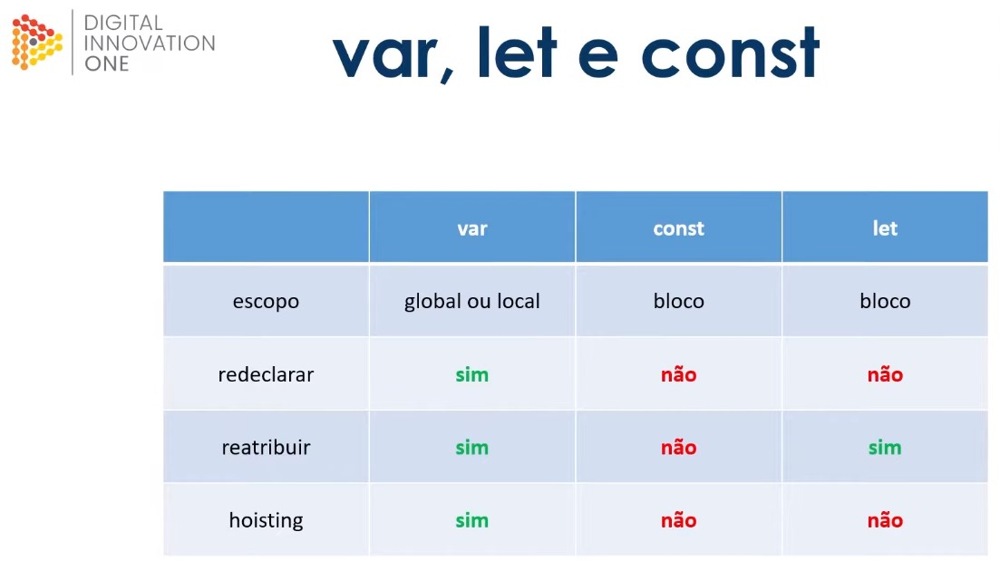

**Camel Case** - duas palavras juntas a segunda com primeira Letra Maiúscula

**Upper Case Snake Case** --> Utilizados por constantes, todas as letras em maíscula[_Upper Case_] e separadas por Underline{_snake case_}

Valores dinâmicos:

Palavras reservadas - Var e let </br>
**var** --> scope is global
**let** --> scope is inside the if-block

**Redeclaração** --> var a = 11; :left_speech_bubble: Você informa o tipo, o nome e o valor </br>
**Reatribuição** --> a = 11; :left_speech_bubble: Você só informa o nome e valor

**Hoisting** --> atribuir um valor a uma variável antes de declará-la

Exemplo de como funciona o Hoisting

Neste exemplo irá funcionar porque ele entende que é uma *var*iável global:

```javascript
numberOne = 1;
console.log(numberOne + 2);

var numberOne;
```

Neste exemplo NÃO irá funcionar porque ele entende que a **_let_** é de escopo e precisa ser declarado antes de atribuído:

```javascript
numberOne = 1;
console.log(numberOne + 2);

let numberOne;
```

> :vertical_traffic_light: Redeclaração e Reatribuição

```javascript
var firstName = "João"; // Variável Global
var lastName = "Souza"; // Variável Global
let alias = "Joaozinho"; // Variável de bloco

if (firstName == "João") {
  var firstName = "Pedro"; // Redeclaração da Variável
  lastName = "Silva"; // Reatribuição da Variável

  /* aqui teremos uma nova variável em outro espaço da memória */
  /* Não ficará disponível fora do escopo */
  let alias = "Pedrinho"; // Variável de bloco

  console.log(`Dentro do bloco if: ${firstName} ${lastName} ${alias}`);
}
console.log(`Fora do Bloco if: ${firstName} ${lastName} ${alias}`);
```

AS CONSTANTES:

São declaradas em SNAKE_UPPER_CASE, escopo de bloco, não faz hoisting

```javascript
const DAYS_IN_A_WEEK = 7; // Variável de bloco
const FIRST_NAME = "Aquiles"; // CONSTANTE declarar com SNAKE_UPPER_CASE
// e Sua atribuição é obrigatória

var LAST_NAME; // Global e não se deve usar com SNAKE_UPPER_CASE
// Uma 'var' pode ser declarada sem atribuição

console.log(FIRST_NAME);

FIRST_NAME = "Maria"; // Constantes não aceitam reatribuição!!!!
// Irá ocorrer erro!
```


